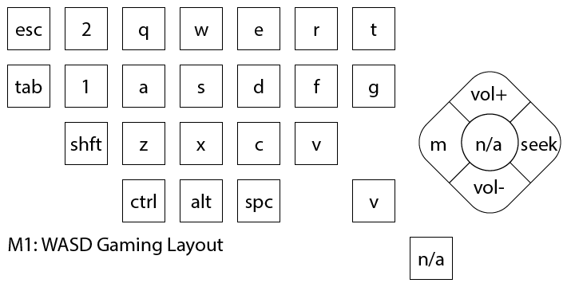
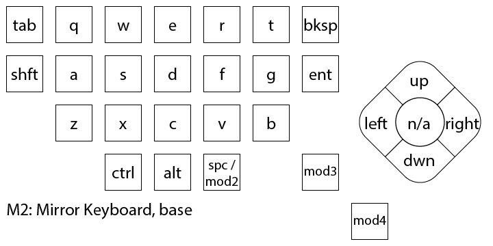
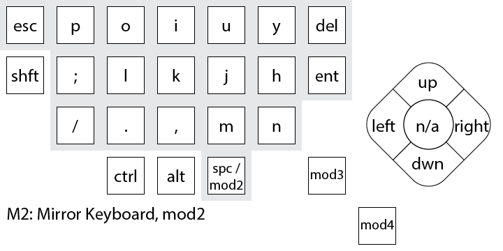
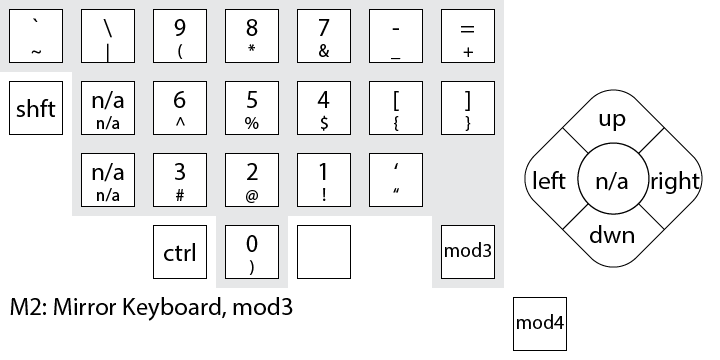

# G13_Keyboard_Profiles
After adding an extensive amount of Lua scripting to my Logitech G13 gaming keyboard, I figured it would be nice to make it available (and back it up) online!

## Default Profile Layouts
Visuals for keymaps:










## Backing Up / Duplicating Profiles

### Profile Management

Exporting profiles is supported in _Logitech Gaming Software_ by going to:  
**"Customize G-keys"** tab **>** **"Profiles"** area **>** [selected profile]'s **Down Arrow** **>** **"Export..."**

Importing profiles is supported in _Logitech Gaming Software_ by going to:  
**"Customize G-keys"** tab **>** **"Profiles"** area **>** **"Import/Export"** (Folder Icon) **>** **"Import..."**

Local profiles are stored in:
```
%USERPROFILE%\Appdata\Local\Logitech\Logitech Gaming Software\Profiles
```
_Note that this doesn't include profiles stored on the Logitech device._


### Modifying a Profile

Profiles are `.xml` files that can be directly edited with simple editors like Notepad.

When creating/duplicating to a new profile, **be sure to change the `<profile name>` to a unique value.**

Example:  
`<profile gpasupported="0" guid="{09D92D75-3C8C-4723-B06C-4090BCB899C0}" gkeysdk="0" launchable="1" gameid="" lastplayeddate="2020-07-21T08:30:59" lock="0" name="Default Profile">`  
becomes  
`<profile gpasupported="0" guid="{09D92D75-3C8C-4723-B06C-4090BCB899C0}" gkeysdk="0" launchable="1" gameid="" lastplayeddate="2020-07-21T08:30:59" lock="0" name="New Profile">`  

**Notice** that the two above lines still have duplicate `guid`s; import the new profile in _LGS_ to give it a new `guid`.  
The `name` still **must be changed** to prevent overwriting the original profile as _LGS_ doesn't support profile renaming.
